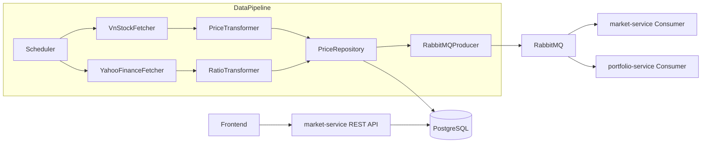
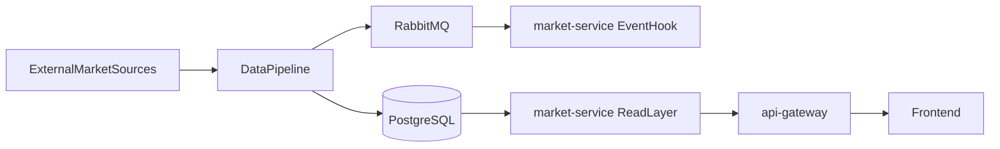

# Market Service — Data Flow

## Vai trò của market-service trong kiến trúc hiện tại

Dựa trên source hiện tại, `market-service` nên được xem là một service đọc dữ liệu market đã được ingest sẵn, thay vì nơi trực tiếp fetch dữ liệu từ nhà cung cấp bên ngoài.

Nguồn dữ liệu hiện tại đang nằm ở `data-pipeline`:
- `VnStockFetcher` lấy giá OHLCV
- `YahooFinanceFetcher` lấy ratio
- `PriceTransformer` và `RatioTransformer` chuẩn hóa dữ liệu
- `PriceRepository` ghi dữ liệu vào PostgreSQL
- `RabbitMQProducer` publish event `price.updated`

Điều này có nghĩa là `market-service` nên tập trung vào:
- query dữ liệu từ PostgreSQL
- trả DTO ổn định cho frontend / service khác
- có thể phản ứng với event RabbitMQ để invalidate cache hoặc theo dõi freshness

## Luồng dữ liệu hiện tại

### Stream A trong data-pipeline

Bắt đầu từ `data-pipeline/app/scheduler.py`:
- scheduler chạy `run_stream_a()` theo chu kỳ
- lấy danh sách `tracked_symbols`
- fetch giá từ VNStock
- fetch ratios từ Yahoo Finance
- transform dữ liệu sang dạng chuẩn hóa
- upsert vào `stock_prices` và `financial_ratios`
- sau khi ghi DB xong mới publish RabbitMQ `market.exchange` / `price.updated`

### Ghi dữ liệu vào PostgreSQL

`PriceRepository` trong `data-pipeline` đang là thành phần ghi dữ liệu thật:
- `upsert_prices()` ghi vào `stock_prices`
- `upsert_ratios()` ghi vào `financial_ratios`
- đều dùng `ON CONFLICT` để update record theo unique key

Điều này làm cho PostgreSQL trở thành source of truth hiện tại của market data trong hệ thống.

### RabbitMQ event sau khi ingest

Sau khi ghi thành công, `data-pipeline` publish event `price.updated`.

Từ `scheduler.py`, payload hiện tại có dạng khái quát:

```json
{
  "symbols": ["FPT", "VCB"],
  "source": "vnstock",
  "timestamp": "2026-06-05T...Z",
  "record_count": 2,
  "action": "price.updated"
}
```

Lưu ý quan trọng:
- payload hiện tại không phải là full `prices[]` và `ratios[]` như một số tài liệu kế hoạch mô tả
- consumer không nên giả định message luôn chứa full dataset
- hiện tại event này phù hợp hơn với ý nghĩa `notify rằng dữ liệu vừa được cập nhật`

## Luồng dữ liệu hiện tại từ đầu đến cuối



## Luồng dữ liệu thực tế so với mong muốn

### Hiện tại
- `data-pipeline` ghi DB thật
- `market-service` chưa query DB thật
- `market-service` consumer chỉ log event
- frontend chưa gọi `market-service`

### Mục tiêu nên hướng tới
- `data-pipeline` tiếp tục là writer của market data
- `market-service` trở thành reader/query layer đáng tin cậy
- frontend gọi `market-service` để lấy latest price, ratios và OHLC chart data
- portfolio-service chỉ dùng event hoặc query market data theo nhu cầu định giá

## Nguồn dữ liệu và responsibility boundary

### Data pipeline chịu trách nhiệm
- kết nối external data source
- retry, throttling, transform, validation input
- upsert dữ liệu vào PostgreSQL
- phát event sau khi DB write thành công

### Market service chịu trách nhiệm
- query dữ liệu đã chuẩn hóa
- chuẩn hóa response DTO cho consumer nội bộ hoặc frontend
- validate request symbol/date
- trả lỗi chuẩn hóa khi dữ liệu thiếu hoặc không hợp lệ
- có thể xử lý cache invalidation / freshness tracking khi nghe event

### Frontend chịu trách nhiệm
- gọi API market qua client riêng
- render chart, cards, dashboard state
- xử lý loading/error/empty state

## Các điểm bất nhất hiện tại cần ghi nhớ

### 1. Frontend type và backend entity chưa thẳng hàng
`frontend/src/lib/types.ts` hiện định nghĩa:
- `StockPrice.date`

Trong khi Java entity hiện có:
- `StockPrice.tradeDate`

Nếu trả entity trực tiếp, frontend sẽ bị mismatch shape. Vì vậy DTO là bắt buộc.

### 2. Payload RabbitMQ hiện tại là notification, không phải snapshot dữ liệu
Nếu team định dùng `MarketDataConsumer` để lưu DB từ payload event thì chưa đủ dữ liệu. Với payload hiện tại, consumer hợp lý hơn cho:
- log freshness
- update cache timestamp
- emit internal metric
- invalidate cache key theo symbol

### 3. Market-service chưa phải source ghi dữ liệu
Không nên để market-service tự fetch VNStock/Yahoo ngay trong giai đoạn này, vì source logic đã tập trung trong `data-pipeline`. Nếu market-service tự fetch thêm, sẽ tạo duplication, lệch data source và khó kiểm soát consistency.

## Đề xuất kiến trúc triển khai đúng với source hiện tại

### Kiến trúc khuyến nghị



Ý nghĩa của kiến trúc này:
- `data-pipeline` là writer
- `market-service` là read layer
- RabbitMQ trong `market-service` đóng vai trò event hook, không nhất thiết là nơi ingest record

## Query path mong muốn cho từng endpoint

### `GET /market/price/{symbol}`
- normalize `symbol`
- query bản ghi `stock_prices` mới nhất theo `trade_date DESC`
- map sang latest price DTO
- nếu không có data thì trả 404 hoặc 204 tùy quyết định contract

### `GET /market/ohlc/{symbol}`
- normalize `symbol`
- parse `startDate` và `endDate`
- query `stock_prices` trong khoảng thời gian
- sort tăng dần theo `trade_date`
- map sang mảng OHLC DTO cho chart

### `GET /market/ratio/{symbol}`
- normalize `symbol`
- query `financial_ratios`
- quyết định sort theo `period` hoặc latest-first
- map sang ratio DTO

## Freshness và stale-data strategy

Một vai trò hợp lý cho RabbitMQ consumer là theo dõi dữ liệu mới nhất:
- nhận event `price.updated`
- trích `symbols[]`
- invalidate cache cho latest price / ohlc của symbol tương ứng
- ghi metric hoặc timestamp cập nhật cuối cùng

Nếu chưa có cache, listener vẫn có thể giữ ở dạng log-only nhưng nên được mô tả rõ là intentional, không phải implementation hoàn chỉnh.

## Tóm tắt kết luận

Luồng dữ liệu market hiện tại nên được hiểu như sau:
- `data-pipeline` là nơi ingest và ghi dữ liệu thật
- PostgreSQL là source of truth cho market data đã chuẩn hóa
- RabbitMQ `price.updated` là tín hiệu rằng dữ liệu đã đổi
- `market-service` nên đọc dữ liệu từ PostgreSQL và trả API ổn định
- frontend hiện chưa nối vào `market-service`, nhưng kiến trúc nên tiến tới theo hướng đó
