# Portfolio Service — Complete UML

> All diagrams are derived directly from the code under `services/portfolio-service`
> (Spring Boot 3.2.5, Java 21, **hexagonal / ports & adapters**).
> Large views are split into cohesive sub-diagrams so nothing is ambiguous.
>
> **Mermaid note:** class diagrams use `~T~` for generics (e.g. `List~Order~`);
> sequence messages use `List[Order]` — both avoid the `<...>` HTML pitfall.

## Contents
1. [Use-Case diagram](#1-use-case-diagram)
2. [Layered / Package diagram](#2-layered--package-diagram)
3. [Component diagram (runtime wiring)](#3-component-diagram-runtime-wiring)
4. [Class diagrams](#4-class-diagrams) — split by concern
   - 4.1 [Domain entities](#41-domain-entities)
   - 4.2 [Persistence repositories](#42-persistence-repositories)
   - 4.3 [Web inbound adapter + inbound ports](#43-web-inbound-adapter--inbound-ports)
   - 4.4 [Application services](#44-application-services)
   - 4.5 [Validation subsystem](#45-validation-subsystem)
   - 4.6 [Reservation subsystem](#46-reservation-subsystem)
   - 4.7 [Matching subsystem](#47-matching-subsystem)
   - 4.8 [Outbound ports + messaging adapters](#48-outbound-ports--messaging-adapters)
   - 4.9 [Security](#49-security)
   - 4.10 [Error handling](#410-error-handling)
5. [State machine — Order lifecycle](#5-state-machine--order-lifecycle)
6. [Sequence diagrams](#6-sequence-diagrams)
7. [Activity diagrams](#7-activity-diagrams)
8. [Deployment diagram](#8-deployment-diagram)

---

## 1. Use-Case diagram

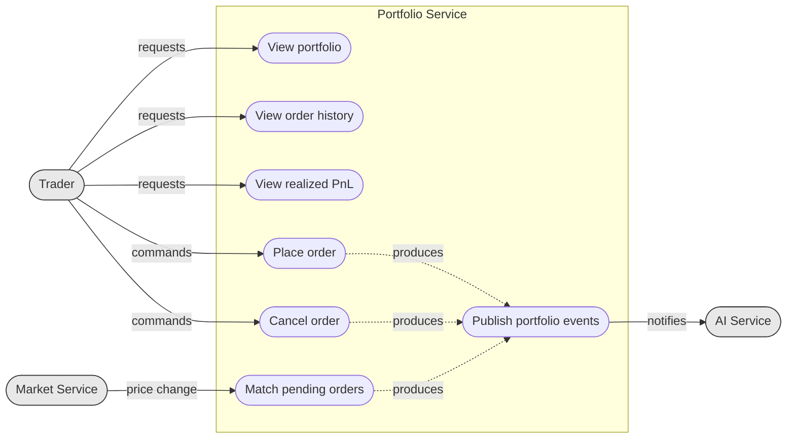

All trader use-cases require a valid JWT (resolved from the gateway-forwarded
`Authorization: Bearer` header). `uc6` is system-triggered by a RabbitMQ message.

---

## 2. Layered / Package diagram

Each node is **one package**; details live in the table below. Solid arrow =
compile-time dependency; dotted arrow = realization / runtime wiring.
Dependency rule: arrows point **inward** — `domain.entity` depends on nothing.

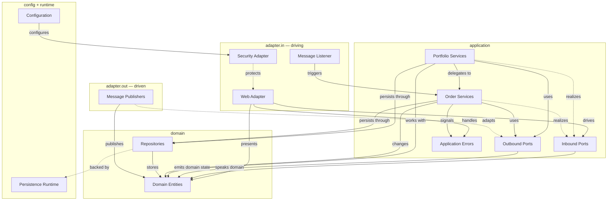

| Package | Key contents |
| --- | --- |
| `adapter.in.web` | `PortfolioController`, `dto/*` (PlaceOrderRequest, OrderResponse, OrderHistoryResponse, PortfolioResponse, PnlResponse, ErrorResponse), `OrderResponseMapper`, `UserIdResolver`, `RestExceptionHandler` |
| `adapter.in.security` | `JwtAuthenticationFilter`, `JwtTokenProvider`, `JwtTokenProviderImpl` |
| `adapter.in.messaging` | `PriceUpdateListener` |
| `application.port.in` | `PlaceOrderUseCase`, `CancelOrderUseCase`, `GetPortfolioUseCase`, `GetPnLUseCase` |
| `application.service` | `PortfolioService`, `PortfolioAccountService` |
| `application.service.order` | `OrderConstants`, `ValidatedOrderRequest`; `lifecycle/` (PlaceOrderService, CancelOrderService, OrderFactory); `validation/`; `reservation/`; `match/` (incl. OrderMatchProcessor) |
| `application.port.out` | `OrderEventPublisher`, `PortfolioEventPublisher` |
| `application.exception` | `BadRequestException`, `ConflictException`, `NotFoundException` |
| `domain.entity` | `Portfolio`, `Holding`, `Order`, `Transaction` |
| `domain.repository` | `PortfolioRepository`, `HoldingRepository`, `OrderRepository`, `TransactionRepository` |
| `adapter.out.messaging` | `RabbitOrderEventPublisher`, `RabbitPortfolioEventPublisher` |
| `config` | `AppConfig`, `RabbitConfig`, `SecurityConfig` |

---

## 3. Component diagram (runtime wiring)

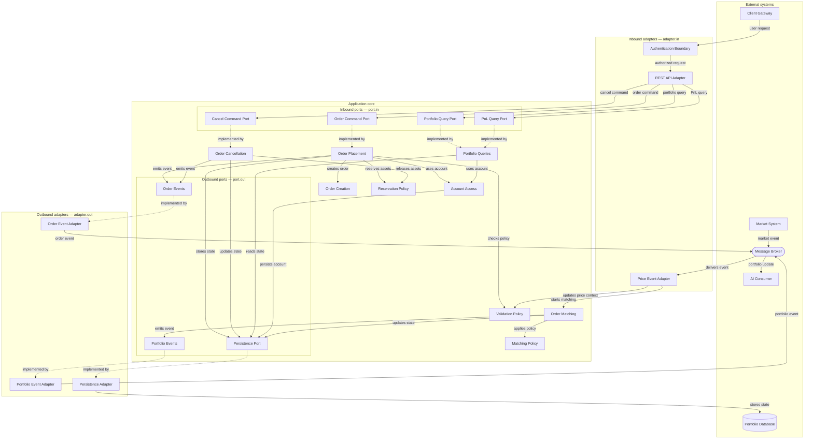

`PriceUpdateListener` writes the latest price into the shared `SymbolPriceCache`
(used by validation) **and** triggers `OrderMatchProcessor`.

---

## 4. Class diagrams

> Ports referenced across several views (`*Repository`, `*EventPublisher`,
> `OrderValidator`, `*StrategyRegistry`) are shown in full in their own subsection;
> elsewhere they appear as plain boxes to keep each view focused.

### 4.1 Domain entities

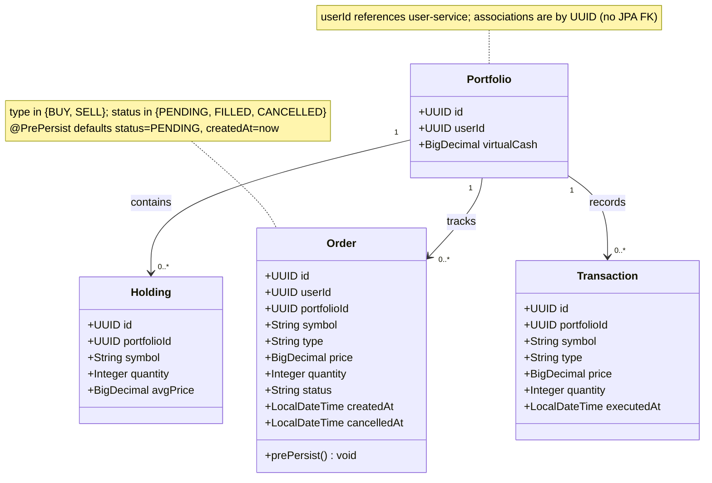

### 4.2 Persistence repositories

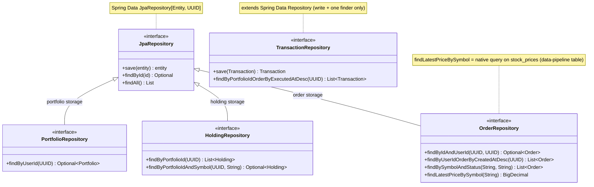

### 4.3 Web inbound adapter + inbound ports

```mermaid
classDiagram
    class PortfolioController {
        <<RestController>>
        +getPortfolio() ResponseEntity
        +placeOrder(PlaceOrderRequest) ResponseEntity
        +getOrders() ResponseEntity
        +cancelOrder(String) ResponseEntity
        +getPnl() ResponseEntity
    }
    class UserIdResolver {
        +resolveCurrentUserId() UUID
    }
    class OrderResponseMapper {
        +placed(Order) OrderResponse
        +cancelled(Order) OrderResponse
    }
    class PlaceOrderUseCase {
        <<interface>>
        +placeOrder(UUID, String, String, Integer) Order
        +placeOrder(UUID, String, String, Integer, BigDecimal) Order
    }
    class CancelOrderUseCase {
        <<interface>>
        +cancelOrder(UUID, Optional) Order
    }
    class GetPortfolioUseCase {
        <<interface>>
        +getPortfolio(UUID) Portfolio
        +getHoldings(UUID) List~Holding~
        +getTransactionHistory(UUID) List~Transaction~
        +getOrderHistory(UUID) List~Order~
    }
    class GetPnLUseCase {
        <<interface>>
        +getTotalPnl(UUID) BigDecimal
    }
    class PlaceOrderRequest {
        <<record>>
        +UUID userId
        +String symbol
        +String type
        +Integer quantity
        +BigDecimal price
    }
    class OrderResponse {
        <<record>>
        +UUID orderId
        +String status
        +String message
    }
    class OrderHistoryResponse {
        <<record>>
        +from(Order) OrderHistoryResponse$
    }
    class PortfolioResponse {
        <<record>>
        +Portfolio portfolio
        +List~Holding~ holdings
        +List~Transaction~ transactions
    }
    class PnlResponse {
        <<record>>
        +BigDecimal totalPnl
    }
    PortfolioController --> PlaceOrderUseCase : order command
    PortfolioController --> CancelOrderUseCase : cancel command
    PortfolioController --> GetPortfolioUseCase : portfolio query
    PortfolioController --> GetPnLUseCase : PnL query
    PortfolioController --> OrderResponseMapper : response mapping
    PortfolioController --> UserIdResolver : user context
    PortfolioController ..> PlaceOrderRequest : input
    PortfolioController ..> OrderResponse : output
    PortfolioController ..> OrderHistoryResponse : output
    PortfolioController ..> PortfolioResponse : output
    PortfolioController ..> PnlResponse : output
```

### 4.4 Application services

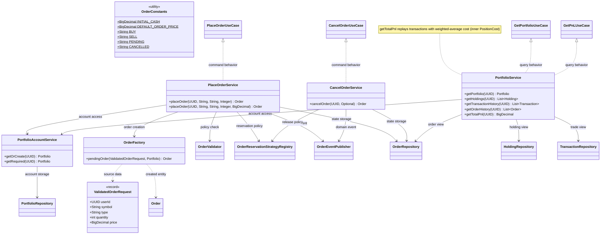

### 4.5 Validation subsystem

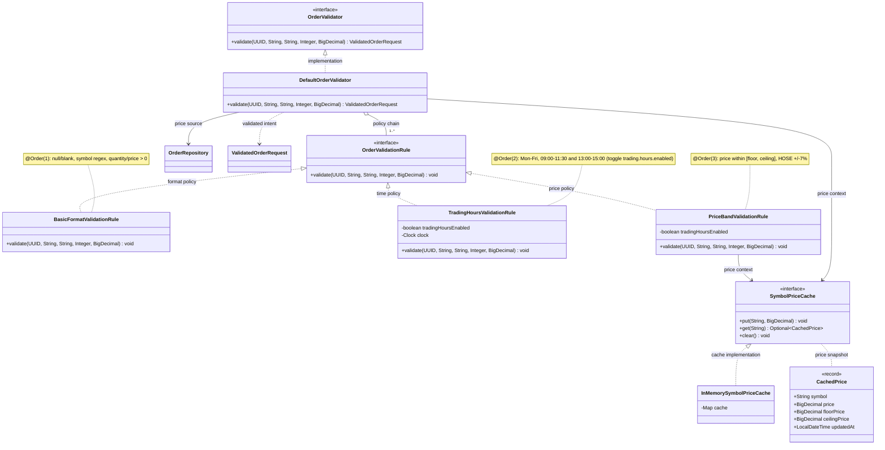

### 4.6 Reservation subsystem

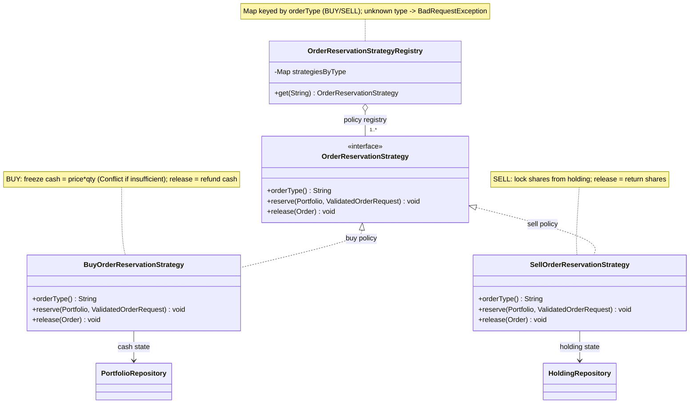

### 4.7 Matching subsystem

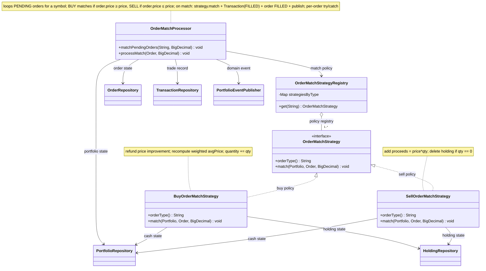

### 4.8 Outbound ports + messaging adapters

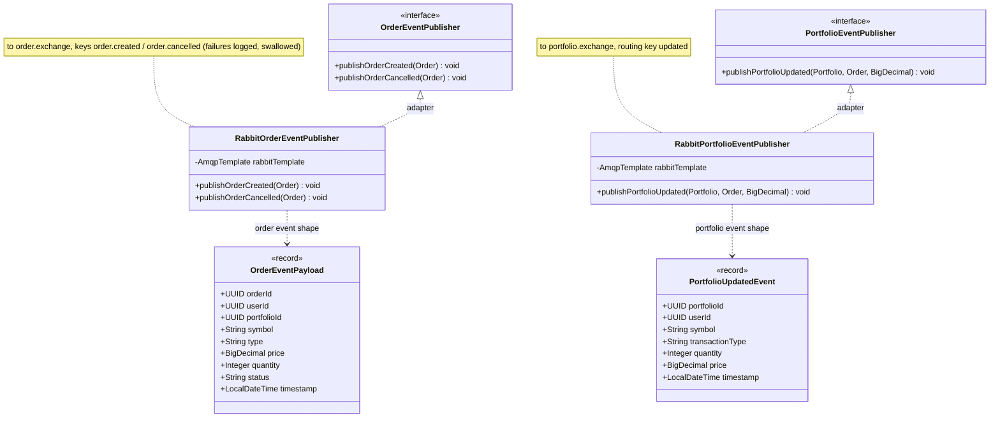

### 4.9 Security

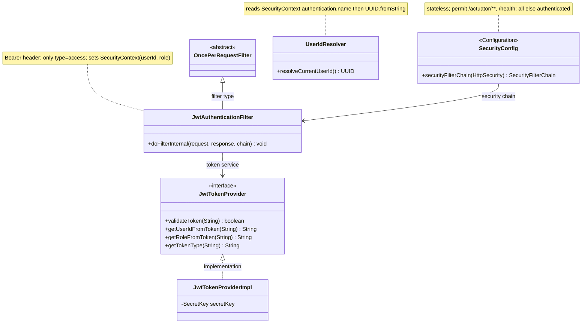

### 4.10 Error handling

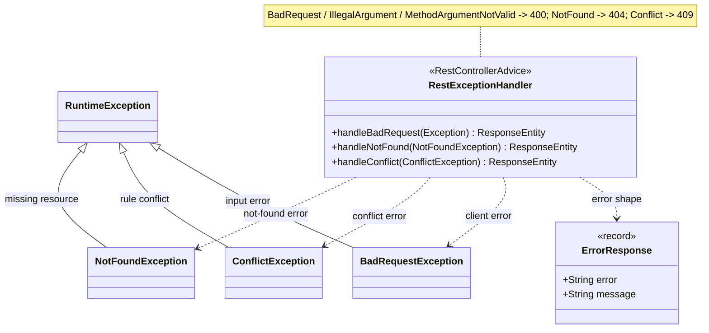

---

## 5. State machine — Order lifecycle

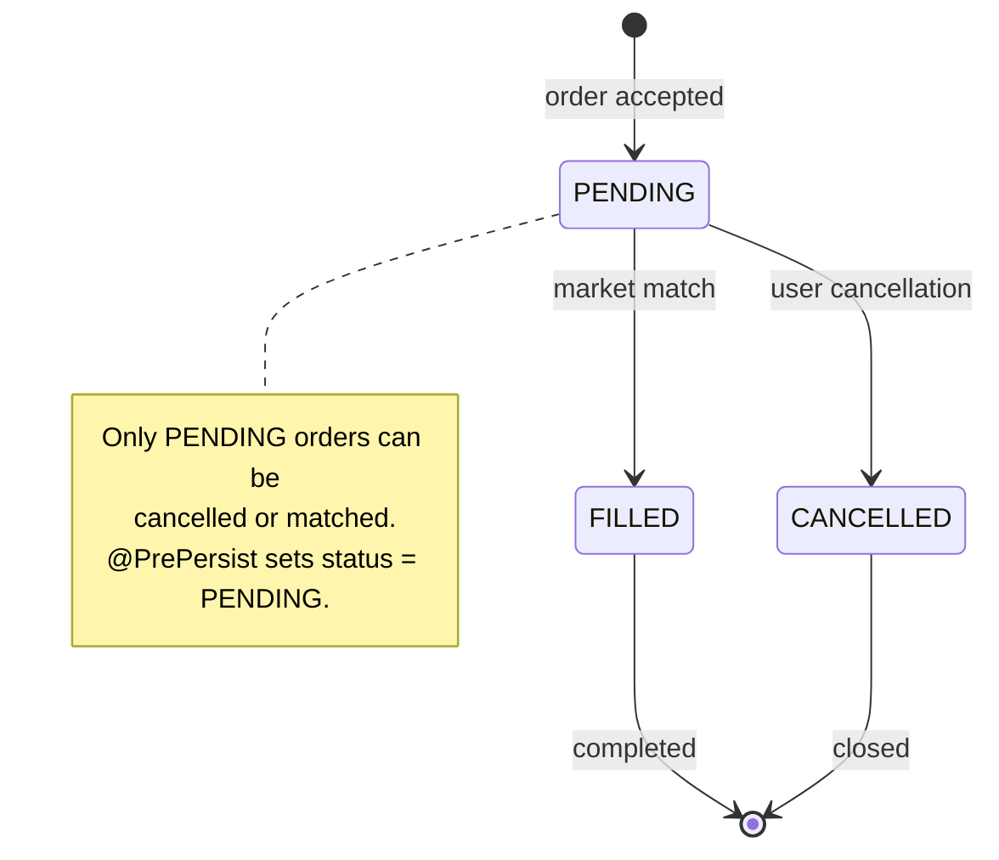

---

## 6. Sequence diagrams

### 6.1 Place Order (`POST /portfolio/order`)

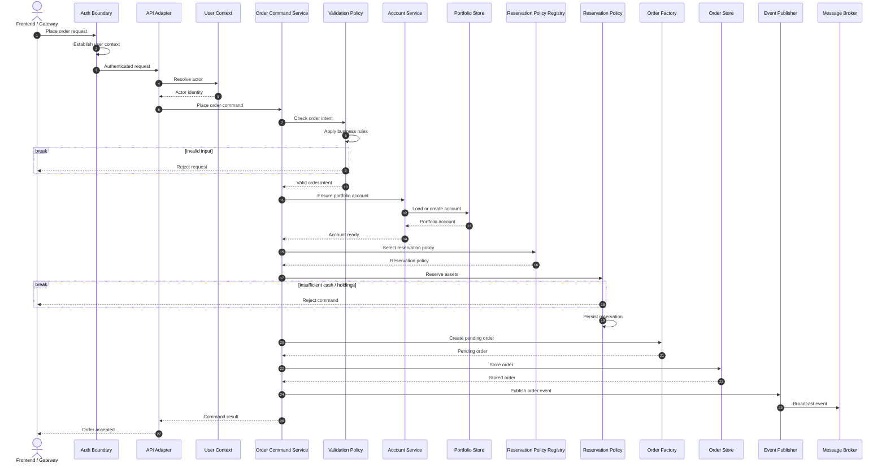

### 6.2 Cancel Order (`DELETE /portfolio/order/{orderId}`)

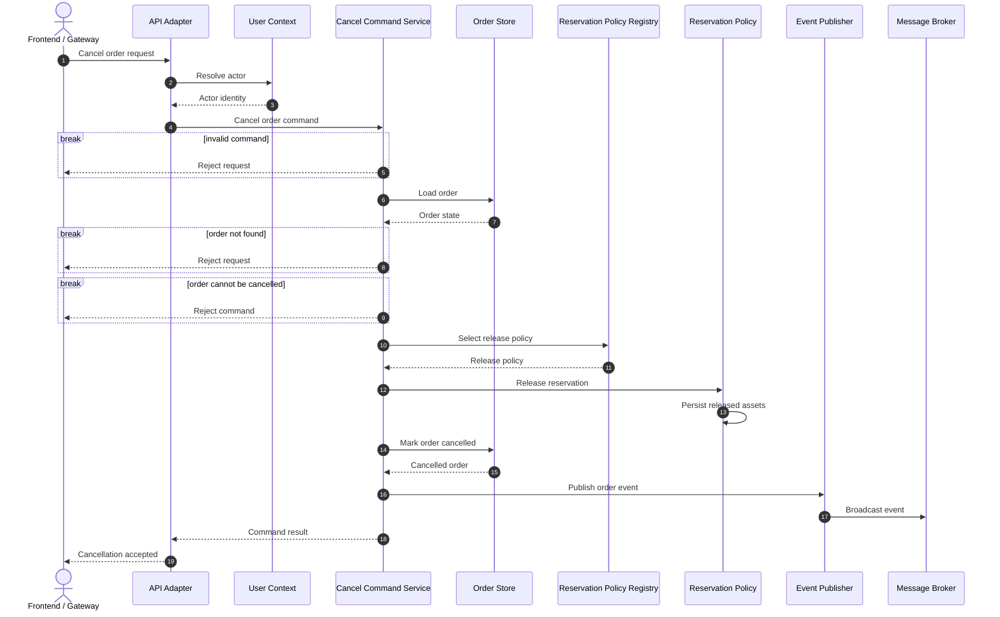

### 6.3 Price Update → Order Matching (event-driven)

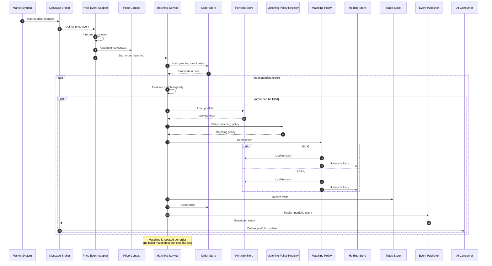

### 6.4 Get Portfolio & PnL (read flows)

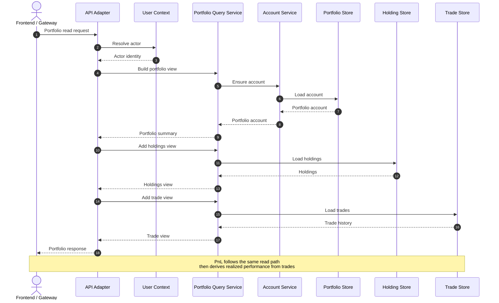

---

## 7. Activity diagrams

### 7.1 Place Order (decision flow)

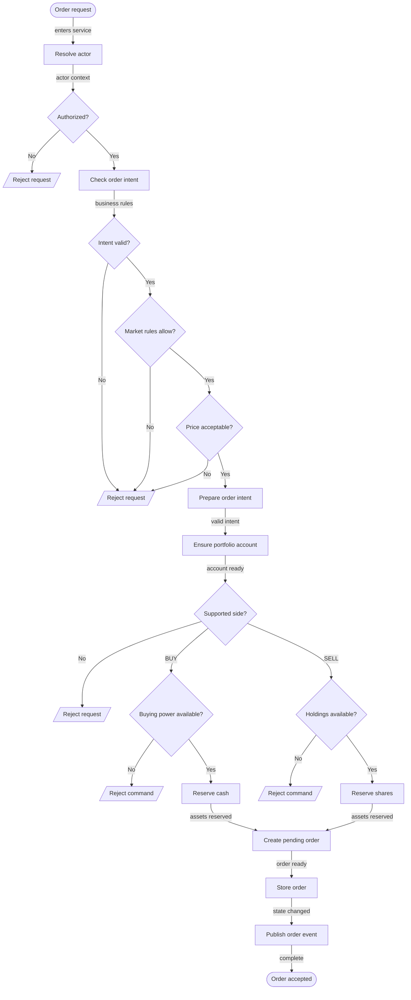

### 7.2 Order Matching (on price update)

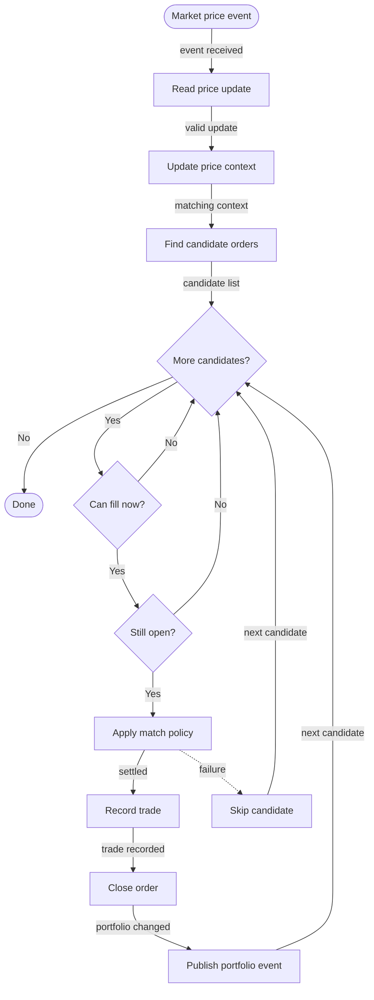

---

## 8. Deployment diagram

```mermaid
flowchart TB
    subgraph client["Client tier"]
        BR["Client App"]
    end
    subgraph net["Docker network: stockwise"]
        GW["API Gateway"]
        subgraph psvc["portfolio-service container"]
            APPJ["Portfolio Service"]
        end
        MS["Market Service"]
        AIS["AI Service"]
        MQN(["Message Broker"])
        PG[("PostgreSQL")]
    end
    BR -->|user traffic| GW
    GW -->|portfolio traffic| APPJ
    APPJ -->|portfolio state| PG
    APPJ <-->|domain events| MQN
    MS -->|market events| MQN
    MQN -->|portfolio updates| AIS
    APPJ -. integration overview .-> note1["Event flow<br/>market -> portfolio<br/>portfolio -> ai<br/>portfolio -> subscribers"]
```

Inside the Docker network, services address each other by service name
(`postgres`, `rabbitmq`), never `localhost`. The `stock_prices` table read by
`OrderRepository.findLatestPriceBySymbol` is owned by the data-pipeline.
