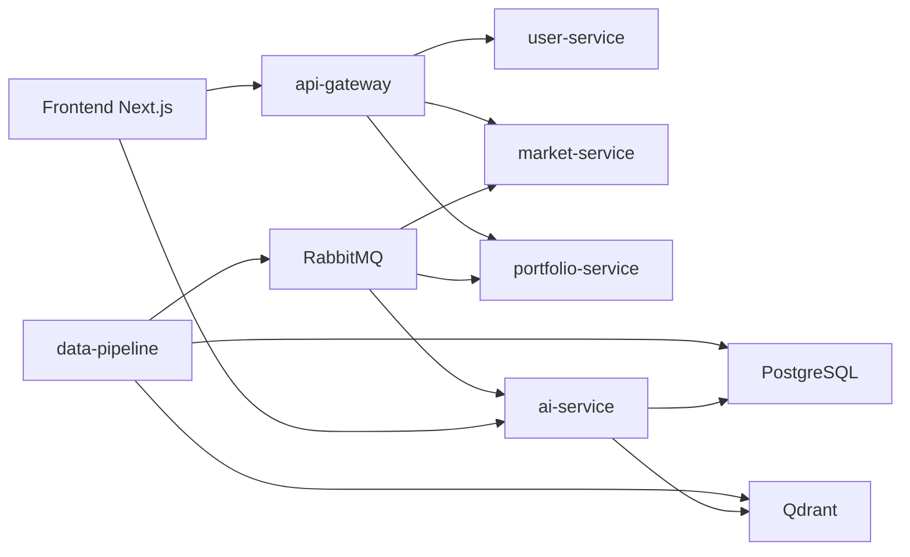

# StockWise Overview

## Mục tiêu tài liệu

`overview.md` là tài liệu điều phối ở cấp dự án, tổng hợp:
- nội dung phân chia module và quy tắc đóng góp từ `kế hoạch.docx`
- kiến trúc và hiện trạng thật của source code hiện tại
- các nguyên tắc phối hợp giữa service, frontend, data pipeline và AI

Tài liệu này không thay thế `README.md`. `README.md` mô tả kiến trúc cấp cao, còn tài liệu này tập trung vào ownership, quy tắc phối hợp, trạng thái triển khai hiện tại và các lưu ý khi làm việc theo module.

## Mục tiêu dự án StockWise

StockWise là hệ thống phân tích chứng khoán và paper trading cho thị trường chứng khoán Việt Nam.

Mục tiêu của hệ thống:
- hiển thị market dashboard và dữ liệu biểu đồ
- cho phép người dùng paper trade trên danh mục giả lập
- tổng hợp tin tức, dữ liệu thị trường và company wiki
- cung cấp AI advisor có khả năng trả lời theo ngữ cảnh
- vận hành theo kiến trúc service-based với PostgreSQL, RabbitMQ, Redis và Qdrant

## Kiến trúc tổng quát

Luồng hệ thống ở mức cao:

1. `frontend` hiển thị dashboard, advisor, portfolio, sandbox và admin views.
2. `api-gateway` là entry point cho các request backend cần auth.
3. `user-service` quản lý đăng ký, đăng nhập, JWT và refresh token.
4. `market-service` cung cấp API đọc dữ liệu giá, ratio và OHLC.
5. `portfolio-service` quản lý holdings, transaction và paper trading.
6. `data-pipeline` ingest giá, ratio, tin tức; ghi PostgreSQL; ghi vector vào Qdrant; publish RabbitMQ events.
7. `ai-service` dùng dữ liệu thị trường, news, wiki và portfolio context để phục vụ advisor.
8. PostgreSQL lưu dữ liệu nghiệp vụ; RabbitMQ phục vụ event-driven integration; Redis hỗ trợ auth/session; Qdrant lưu vector news.

### Sơ đồ khái quát



## Messaging hiện tại

Dự án đã chuyển sang RabbitMQ. Không nên thêm Kafka cho code mới.

### Event contract chính

| Exchange | Routing key | Consumer chính | Mục đích |
|---|---|---|---|
| `market.exchange` | `price.updated` | `market-service`, `portfolio-service` | Báo có dữ liệu giá mới |
| `news.exchange` | `raw.ingested` | `ai-service` / synthesis flow | Báo có bài báo mới |
| `portfolio.exchange` | `updated` | `ai-service` | Báo portfolio của user thay đổi |
| `wiki.exchange` | `synthesis.requested` | synthesis agent | Yêu cầu tổng hợp hoặc cập nhật wiki |

Quy tắc bắt buộc:
- nếu đổi payload RabbitMQ phải báo producer owner và consumer owner
- không xóa field đang được consumer dùng
- field mới nên tương thích ngược trong ít nhất một sprint

## Phân chia module và ownership

### Module 1 - AI Advisor
- Owner: Lead / AI
- Backend chính:
  - `ai-service/app/api/`
  - `ai-service/app/agents/`
  - `ai-service/app/graph/`
  - `ai-service/app/tools/`
  - `ai-service/app/models/`
  - `ai-service/app/db/`
- Frontend chính:
  - `frontend/src/app/dashboard/advisor/`
  - `frontend/src/components/advisor/`
  - các phần advisor liên quan trong `frontend/src/lib/api.ts` và `frontend/src/lib/types.ts`
- Trách nhiệm:
  - SSE advisor endpoint
  - workflow agent/router/tool
  - safety và risk warning
  - company wiki / retrieval / advisor UX

### Module 2 - Auth, User, API Gateway
- Owner: Member 2
- Backend chính:
  - `services/api-gateway/`
  - `services/user-service/`
- Frontend chính:
  - `frontend/src/app/(auth)/login/`
  - `frontend/src/app/(auth)/register/`
  - phần auth trong `frontend/src/lib/api.ts`, `frontend/src/lib/types.ts`
- Trách nhiệm:
  - register, login, refresh token
  - JWT validation
  - gateway route protection
  - logout và auth state

### Module 3 - Market Data và Chart
- Owner: Member 3
- Backend chính:
  - `services/market-service/`
- Frontend chính:
  - `frontend/src/app/dashboard/page.tsx`
  - `frontend/src/components/charts/`
  - phần market trong `frontend/src/lib/api.ts`, `frontend/src/lib/types.ts`
- Trách nhiệm:
  - API giá mới nhất
  - API financial ratios
  - API OHLC/chart
  - consume `price.updated` nếu dùng cho cache/aggregation/read model

### Module 4 - Portfolio và Paper Trading
- Owner: Member 4
- Backend chính:
  - `services/portfolio-service/`
- Frontend chính:
  - `frontend/src/app/dashboard/portfolio/`
  - `frontend/src/app/dashboard/sandbox/`
- Trách nhiệm:
  - holdings, transaction, PnL
  - paper order flow
  - emit portfolio events cho AI context

### Module 5 - Data Pipeline, Database, Admin
- Owner: Member 5
- Backend/Data chính:
  - `data-pipeline/`
  - `infra/postgres/`
  - `infra/qdrant/`
- Frontend liên quan:
  - `frontend/src/app/dashboard/admin/` nếu có admin UI
- Trách nhiệm:
  - seed data
  - price/ratio ingestion
  - news crawling
  - embedding vào Qdrant
  - RabbitMQ producer
  - wiki synthesis

## File chung và quy tắc ownership

| File/Phạm vi | Ownership / lưu ý |
|---|---|
| `docker-compose.yml` | Member 5 chỉnh chính, Lead review |
| `.env.example` | thêm biến mới phải có mô tả và giá trị mặc định hợp lý |
| `README.md` | Lead phụ trách kiến trúc tổng quan |
| `frontend/src/lib/api.ts` | chia theo section module |
| `frontend/src/lib/types.ts` | chia theo section, không đổi shared types tùy tiện |
| `frontend/src/app/dashboard/layout.tsx` | sửa phải báo team |
| `frontend/src/components/ui/` | component dùng chung, không sửa nếu chưa thống nhất |
| `infra/postgres/init.sql` | Member 5 quản lý, đổi schema phải trao đổi trước |

## Quy tắc hạn chế conflict

1. Mỗi task làm trên branch riêng.
2. Prefix branch:
   - `ai/<task>`
   - `auth/<task>`
   - `market/<task>`
   - `portfolio/<task>`
   - `pipeline/<task>`
   - `frontend/<task>` cho UI chung
3. Không sửa service của người khác nếu chưa hỏi owner.
4. Không sửa `dashboard/layout.tsx`, navigation hoặc `components/ui/` nếu chưa báo team.
5. Nếu đổi API contract thì frontend API client/types phải cập nhật cùng PR hoặc trong PR liên quan.
6. Nếu đổi database schema thì PR phải ghi rõ bảng, cột, service dùng và dữ liệu mẫu nếu có.
7. Nếu đổi RabbitMQ payload phải báo producer owner và consumer owner.
8. Tuyệt đối không commit `.env`, API key, JWT secret hoặc password database.
9. Trong Docker network, service nên gọi nhau bằng service name thay vì `localhost`.
10. Mặc định làm việc qua PR, không push trực tiếp lên `main` nếu chưa thống nhất.

## Quy tắc API contract

Trước khi làm full-stack feature, owner nên thống nhất:
- method và path
- auth required hay none
- request body hoặc query params
- response body
- status code
- error format
- component frontend nào sử dụng endpoint đó

Ví dụ chuẩn mong muốn cho market:

- Endpoint: `GET /market/price/{symbol}`
- Owner: Module Market
- Auth: required
- Input: `symbol` uppercase
- Output: latest price DTO có `symbol`, `price`, `change`, `changePercent`, `updatedAt`
- Errors: `404 SYMBOL_NOT_FOUND`, `503 MARKET_DATA_UNAVAILABLE`

## Quy tắc kiểm tra trước khi tạo PR

### Frontend
```bash
cd frontend
npm run lint
npm run build
```

### Java service
```bash
cd services/<service-name>
mvn test
mvn package
```

### AI service
```bash
cd ai-service
python -m compileall app
```

### Data pipeline
```bash
cd data-pipeline
python -m compileall app
```

### Docker/integration
```bash
docker compose config
docker compose up --build <service>
```

Nếu local thiếu tool, phải ghi rõ trong PR là chưa chạy được lệnh nào và vì sao.

## Gợi ý format PR

Ví dụ tiêu đề:
- `[AI] Add advisor retrieval node`
- `[AUTH] Implement refresh token`
- `[MARKET] Add OHLC endpoint`
- `[PORTFOLIO] Add paper order flow`
- `[PIPELINE] Add news ingestion job`

PR description nên có:
- đã làm gì
- file/module đã sửa
- cách kiểm tra
- có đổi API/schema/env/RabbitMQ payload không
- screenshot nếu sửa UI
- rủi ro còn lại

## Hiện trạng source code hiện tại

Phần này phản ánh code hiện đang có trong repo, không chỉ là kế hoạch mong muốn.

### Những phần đang có nền tảng tốt
- `data-pipeline` là phần hoàn thiện nhất về mặt ingest và ghi dữ liệu.
- PostgreSQL schema cho `stock_prices` và `financial_ratios` đã có trong `infra/postgres/init.sql`.
- `market-service` đã có controller, entity, repository, RabbitMQ config.
- `api-gateway` và `user-service` đã có nền auth/JWT.
- `docker-compose.yml` đã khai báo tương đối đầy đủ hạ tầng và service.

### Những phần còn stub hoặc placeholder
- `market-service` hiện trả mock data trong service layer, chưa query DB thật.
- RabbitMQ consumer của `market-service` hiện chỉ log message.
- frontend dashboard, portfolio và chart vẫn chủ yếu là placeholder/mock data.
- frontend chưa có `marketApi` trong `frontend/src/lib/api.ts`.
- `ai-service` advisor hiện mới có skeleton và streaming mock ở nhiều chỗ.

## Khoảng cách giữa kế hoạch và source hiện tại

### Market
Kế hoạch mong muốn `market-service` là nguồn backend chính cho giá, ratio và OHLC. Trong source hiện tại:
- endpoint đã tồn tại
- entity và repository đã tồn tại
- nhưng business logic vẫn hardcode dữ liệu
- frontend chưa dùng các endpoint này

### Portfolio
Kế hoạch mong muốn portfolio và PnL hoàn chỉnh. Trong source hiện tại, luồng portfolio có cấu trúc nhưng UI vẫn còn mock nhiều phần.

### AI Advisor
Kế hoạch mô tả advisor theo LangGraph, tool routing và grounding đầy đủ. Source hiện tại đã có scaffold nhưng chưa hoàn chỉnh ở mức production.

### Data pipeline
Đây là phần gần với kế hoạch nhất. Pipeline đã có fetcher, repository, producer RabbitMQ và các thành phần liên quan đến synthesis/news ingestion.

## Sprint gợi ý ở mức thực thi

### Sprint 1
- dựng skeleton chạy được cho từng service
- hoàn thiện auth cơ bản
- hoàn thiện market endpoints bằng DB thật
- hoàn thiện portfolio/order flow cơ bản
- đảm bảo pipeline seed và ingest chạy được

### Sprint 2
- tích hợp market frontend với market-service
- tích hợp portfolio với price updates
- advisor đọc context từ wiki/market/portfolio
- thêm refresh token flow và admin/source controls nếu cần

### Sprint 3
- tăng chất lượng demo
- xử lý stale data, edge cases, safety, evals
- kiểm tra end-to-end qua Docker Compose

## Checklist cho thành viên khi nhận task

1. Xác định task thuộc module nào.
2. Tạo branch đúng prefix.
3. Đọc phạm vi file được phép sửa.
4. Nếu sửa file chung, báo owner trước.
5. Viết API/event contract nếu task liên quan nhiều module.
6. Implement trong đúng phạm vi module.
7. Chạy test/build liên quan.
8. Tạo PR đúng format, nêu rõ thay đổi và rủi ro còn lại.

## Tài liệu liên quan

- `README.md`: kiến trúc cấp cao và cách chạy hệ thống
- `docs/market-service/`: bộ tài liệu triển khai riêng cho market-service
